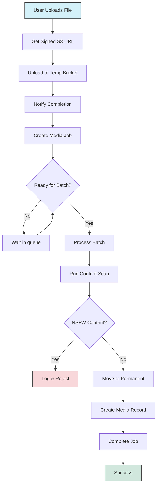

# 📦 Media Upload & Queuing Flow

  

This document outlines the **media upload and initial processing flow** for the Media Service. This includes validation, secure upload URL generation, metadata persistence, and job queuing for scanning.

  

---

  

## 📁 File: `index.js`

  

### 🧠 Purpose

  

Sets up the Express application and routes.

  

### 🚀 Behavior

  

- Loads environment variables via `dotenv`

- Initializes the Express server

- Mounts the `/media` route from `routes/media.js`

- Starts the app on the configured port (`PORT` or fallback to `3000`)

  

---

  

## 📁 File: `routes/media.js`

  

### 🧠 Purpose

  

Handles media upload lifecycle:

- Generates signed upload URLs

- Validates requests

- Stores metadata

- Marks uploads as completed

- Queues files for scanning

  

---

  

## 🔁 API Endpoints

  

---

  

### `POST /media/request-upload`

  

#### 🔒 Authentication

Required (via `authenticate` middleware)

  

#### 📝 Request Body

  

```json

{

"user_id": "string",

"file_name": "example.jpg",

"file_size": 1048576,

"mime_type": "image/jpeg",

"sha256_hash": "64-character-hex",

"linked_to_id": "string",

"linked_to_type": "post",

"md5Hash": "32-character-hex"

}
```
  

---

  

## 🧩 File: `services/queue.js`

  

### 🧠 Purpose

  

Batching, timing, and queuing logic for media scanning — **core orchestrator** that buffers jobs and ensures efficient scan execution using batching thresholds and timers.

  

---

  

### 🧪 Behavior Summary

  

- Maintains **separate queues** for images and videos.

- Uses configurable **batch sizes** and **timeouts** to:

- Avoid overloading the scanner engine

- Avoid starving single items for too long

- Automatically **retries old jobs** at startup.

  

---

  

### 🧮 Constants

  


| Constant           | Value     | Description                             |
|--------------------|-----------|-----------------------------------------|
| `IMAGE_BATCH_SIZE` | `50`      | Max number of images per batch          |
| `VIDEO_BATCH_SIZE` | `10`      | Max number of videos per batch          |
| `IMAGE_MAX_WAIT`   | `10000ms` | Max wait time before forcing a flush    |
| `VIDEO_MAX_WAIT`   | `10000ms` | Max wait time before forcing a flush    |


  

---

  

### 📤 `queueMediaJob(job)`

  

Main entry point to enqueue a job from upload complete. Adds job to image or video queue, and triggers a flush cycle if needed.

  

---

  

### ⏱️ Batching Logic

  

- `scheduleFlush(isVideo)`:

- Starts timer if first item

- Forces flush when:

- Enough time has passed, OR

- Queue reaches batch size

  

- `maybeFlushImages()` & `maybeFlushVideos()`:

- Actually runs the scan job

- Blocks concurrent scans

  

---

  

### 🧯 Recovery Mode (Startup)

  

When the module loads:

- Fetches any **pending scan jobs** from DB (missed/failed/never scanned)

- Generates signed URLs for each job

- Re-enqueues them via `queueMediaJob()`

  

---

  

## 🧩 File: `services/media_scanner.js`

  

### 🧠 Purpose

  

Scans media jobs using:

- Google Vision (for small batches of images)

- External Modal Function (for videos or large image batches)

  

Also moves processed files to correct buckets, and creates final DB record.

  

---

  

### 📦 Bucket Resolution Logic

  

Uses `bucketMap` based on `linked_to_type`. Examples:

  


| Linked To Type        | Bucket                   |
|-----------------------|--------------------------|
| `post`                | `posts-media`            |
| `opportunity`         | `opportunities-media`    |
| `profile_picture`     | `users-media`            |
| `project`             | `talent-profiles-media`  |
| _(default)_           | `default-bucket`         |


  

File pathing depends on type:

- `post` / `opportunity`: keep filename

- All others: `linked_to_type/filename` (sharded per category)

  

---

  

### 🔍 `scanMediaJobs(jobs, type)`

  

1. If `type === "images"` and small batch (≤16) → use `safeSearchFromUrls()`

2. Else → use `scanMediaFn` from Modal

  

---

  

### 🧱 Scan Result Processing

  

For each job:

- If NSFW:

- Logs system report

- Skips insertion

- Else:

- Moves file to proper bucket and key

- Persists media metadata via `createMediaItem()`

- Marks job as completed

  

---

  

### 🔁 `withRetry(fn, payload)`

  

Retries `scanMediaFn.remote()` up to 3 times with delay.

  

---

  

### 💾 `createMediaItem({ ... })`

  

Creates a **final approved media DB entry** with metadata:

- Dimensions

- MIME type

- SHA256

- Duration (if video)

- Bucket path

  

---

  

### 🛡️ `logSystemReport({ media_id,  reason })`

  

Stubbed logger for now. Should log NSFW events for audit/mod tools.

  

---

  

## 🛠️ Function: `scanMediaFn`

  

Remote Modal Function:

- Named: `"tomouh-scan-engine"`

- Exposed via `modal.Function_.lookup`

- Accepts `{ type,  jobs: [{ job_id,  url }] }` payload

  

---

  

## ✅ Example Job Flow

  


